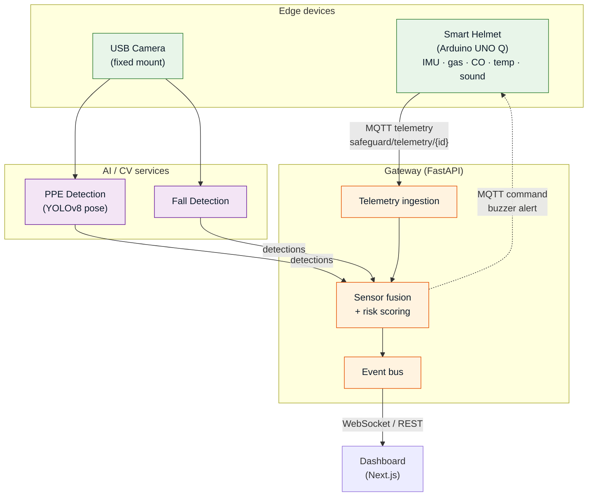

# SafeGuard

> AI-Powered Industrial Worker Safety System
> Snapdragon Multiverse Hackathon 2026, Bangalore

## Links

## Overview

SafeGuard is an AI-powered system that helps keep industrial workers safe in
real time. It pairs a sensor-equipped smart helmet with a camera-based vision
system to watch over each worker on site. The helmet tracks a worker's
surroundings and wellbeing, while the vision system checks that safety gear is
worn and spots dangerous situations. Both streams come together into a single,
easy-to-read measure of risk. When something goes wrong, supervisors are alerted
instantly on a live dashboard and the worker's helmet can respond on the spot.
The goal is simple: catch hazards early and keep people safe.

## Architecture

## Tech Stack

| Layer | Technology |
|-------|------------|
| Helmet firmware | Arduino UNO Q, MQTT |
| Vision / AI | YOLOv8 pose (ONNX), FastAPI |
| Gateway | Python, FastAPI, Mosquitto, Redis, PostgreSQL |
| Dashboard | Next.js |
| Infra | Docker, Kubernetes, GitHub Actions (GHCR) |

## Team

<table>
  <tr>
    <td align="center">
      <a href="https://github.com/Shrish2006">
         
        <b>Shrish Makwana</b>
      </a>
    </td>
    <td align="center">
      <a href="https://github.com/ankitagrawal282">
         
        <b>Ankit Agrawal</b>
      </a>
    </td>
    <td align="center">
      <a href="https://github.com/namanch6">
         
        <b>Naman Chauhan</b>
      </a>
    </td>
    <td align="center">
      <a href="https://github.com/upayanmazumder">
         
        <b>Upayan Mazumder</b>
      </a>
    </td>
    <td align="center">
      <a href="https://github.com/Cheetos-gif">
         
        <b>Chitrita Gahlot</b>
      </a>
    </td>
  </tr>
</table>

## License

Released under the [MIT License](LICENSE).
