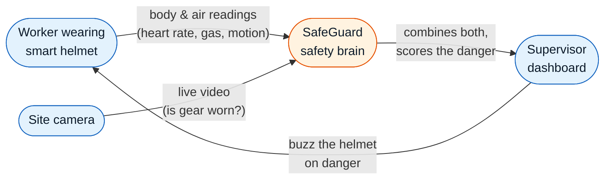
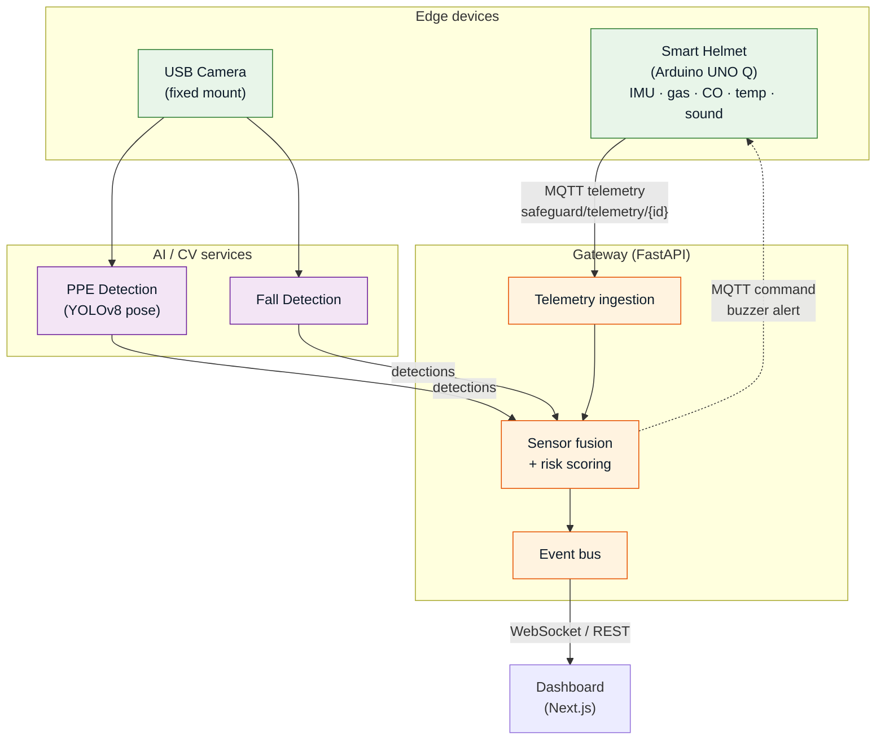
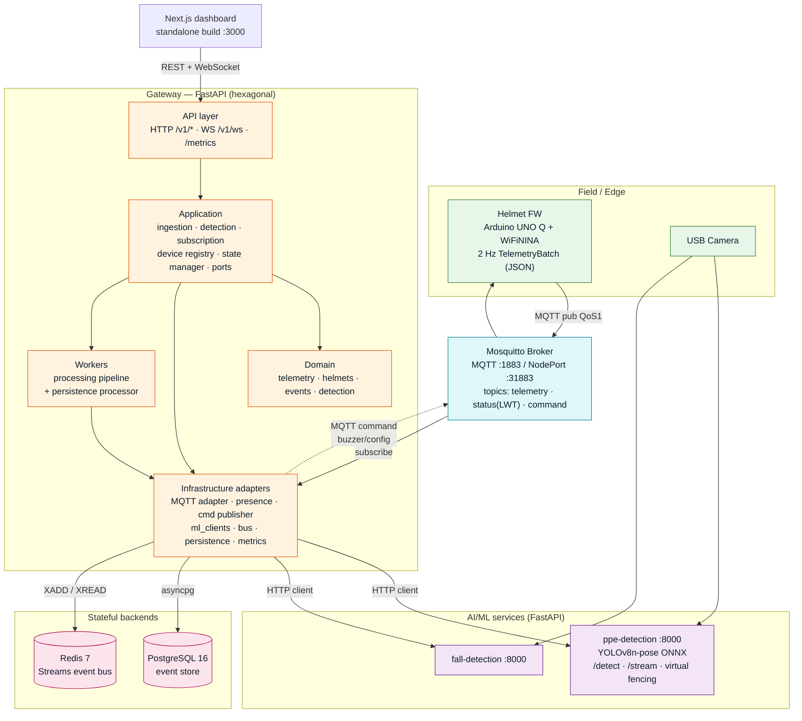

# SafeGuard — Architecture Diagrams

High-level block diagrams of the SafeGuard industrial worker safety system, at
three levels of technical depth. All render as Mermaid.

SafeGuard fuses two streams into a unified risk score: a sensor-equipped smart
helmet (Arduino UNO Q) streaming telemetry over MQTT, and a fixed camera feed
running computer-vision PPE / fall detection. Alerts surface on a Next.js
dashboard and can buzz the helmet back.

---

## 1. Less technical — plain-language / stakeholder view

What it does, no jargon.

---

## 2. Medium technical — component / data-flow view

Named components, real protocols, the two fused streams.

---

## 3. Highly technical — system architecture view

Deployment topology, gateway hexagonal layers, data stores, protocols.

